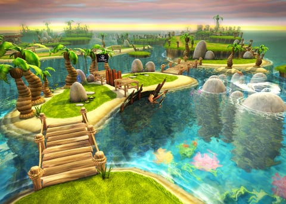

La mise à jours 2.0 de mon projet est arrivé 
Ce qu'elle ajoute :
  -
  - un nouveau bouton tutoriel qui explique les règles du jeu
  - un nouveau mode en solo qui vous permet d'affronter une IA
  - corrections de bugs multiples :
      - correction du bug des boutons qui disparaisaient quand on cliquait dessus
      - correction de la musique qui ne se lançait pas
      - suppression du bouton rejouer qui faisait planter le jeu
      - correction du diaporama en arrière plans qui n'apparaisait pas

